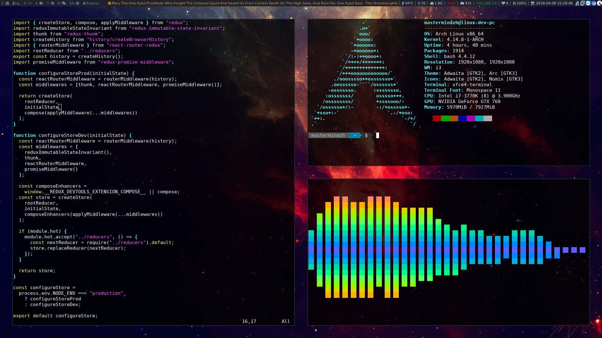

# dotfiles

This repository holds my Linux config files.

## Mandatory unixporn screenshot

## Tools

| Purpose           | Tool                                 |
|-------------------|--------------------------------------|
| WM                | i3 (i3-gaps)                         |
| App launcher      | rofi                                 |
| Shell             | Bash                                 |
| Package managers  | Pacman & Trizen                      |
| OS                | Arch Linux (or Antergos if I'm lazy) |
| Terminal          | xfce4-terminal                       |
| Editor            | nano                                 |
| Code editor       | vscode / jetbrains stuff             |
| Browser           | Chromium                             |
| File manager      | If I have to use one ... Nautilus    |
| Music             | Google Play Music Desktop Player     |
|                   |                                      |

