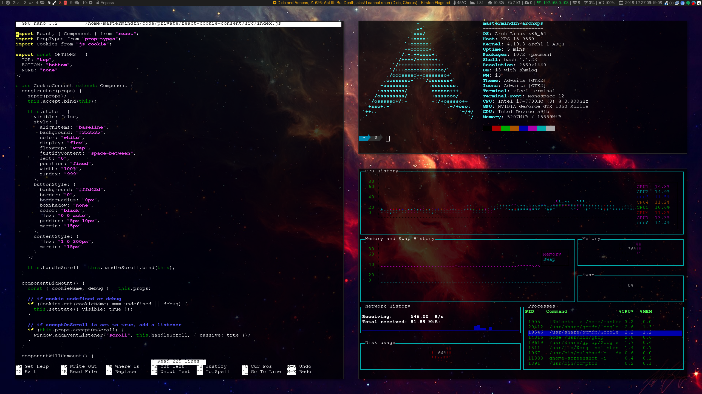

# dotfiles

This repository holds my Linux config files.

## Mandatory unixporn screenshots

New version as of dec 2018:

Older versions:

- [dotfiles](media/dotfiles.png)
- [dotfiles2](media/dotfiles2.png)

## Tools

| Purpose           | Tool                                 |
|-------------------|--------------------------------------|
| WM                | i3 (i3-gaps)                         |
| App launcher      | rofi                                 |
| Shell             | Bash                                 |
| Package managers  | Pacman & Trizen                      |
| OS                | Arch Linux (or Antergos if I'm lazy) |
| Terminal          | xfce4-terminal                       |
| Editor            | nano                                 |
| Code editor       | vscode / jetbrains stuff             |
| Browser           | Chromium                             |
| File manager      | If I have to use one ... Nautilus    |
| Music             | Google Play Music Desktop Player     |
|                   |                                      |

## computer specifc setup

Nowadays I use a few different computers and I'd used to apply the base config and configure each pc on its own.
I've grown tired of this approach however so I added a "pc specific" setup in the installer.

The pc specific setup bit will read the folder names in computers, offer you a choice, and execute the install.sh inside that folder.
This allows me to get pc specific settings synced with git and applied easily.