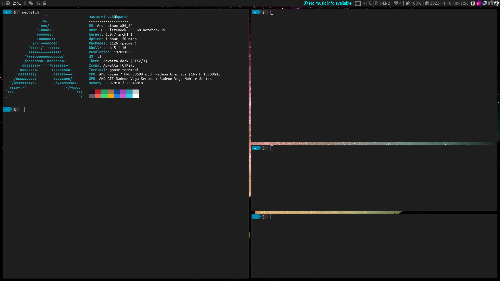

# dotfiles

This repository holds my Linux config files.

## Mandatory unixporn screenshots

New version as of Nov 2022:

I changed the terminal out for gnome-terminal, full-screen it has the same color-hue as the i3bar:

Older versions:

- [dotfiles4](https://raw.githubusercontent.com/Mastermindzh/dotfiles/master/media/dotfiles4.jpg)
- [dotfiles3](media/dotfiles3.png)
- [dotfiles2](media/dotfiles2.png)
- [dotfiles](media/dotfiles.png)

## Tools

| Purpose          | Tool                                                                   |
| ---------------- | ---------------------------------------------------------------------- |
| WM               | i3 (i3-gaps)                                                           |
| App launcher     | rofi                                                                   |
| Shell            | Bash                                                                   |
| Package managers | Pacman & Trizen                                                        |
| OS               | Arch Linux                                                             |
| Terminal         | gnome-terminal                                                         |
| Editor           | nano                                                                   |
| Code editor      | vscode                                                                 |
| Browser          | Firefox                                                                |
| File manager     | If I have to use one ... Nautilus                                      |
| Music            | Tidal through [Tidal-hifi](https://github.com/Mastermindzh/tidal-hifi) |
|                  |                                                                        |

## computer specifc setup

Nowadays I use a few different computers and I'd used to apply the base config and configure each pc on its own.
I've grown tired of this approach however so I added a "pc specific" setup in the installer.

The pc specific setup bit will read the folder names in computers, offer you a choice, and execute the install.sh inside that folder.
This allows me to get pc specific settings synced with git and applied easily.

## Getting x info to use in i3

Some things are handled by window class/title or have custom resolutions set, the tools below help obtaining the info required:

- xprop -> displays static xwindow info including Window class
- xwininfo -> displays xwindow info including current size/position

## getting icons

Copy/paste icons from this url: [https://fontawesome.com/v5/cheatsheet](https://fontawesome.com/v5/cheatsheet)

## after-install

After install read [./docs/afterinstall.md](./docs/afterinstall.md)
